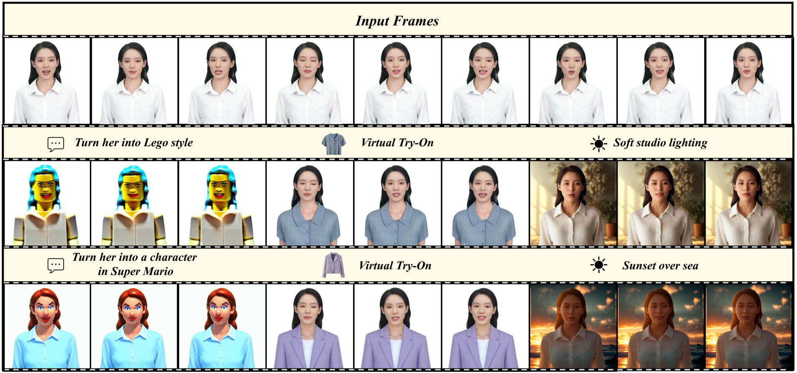
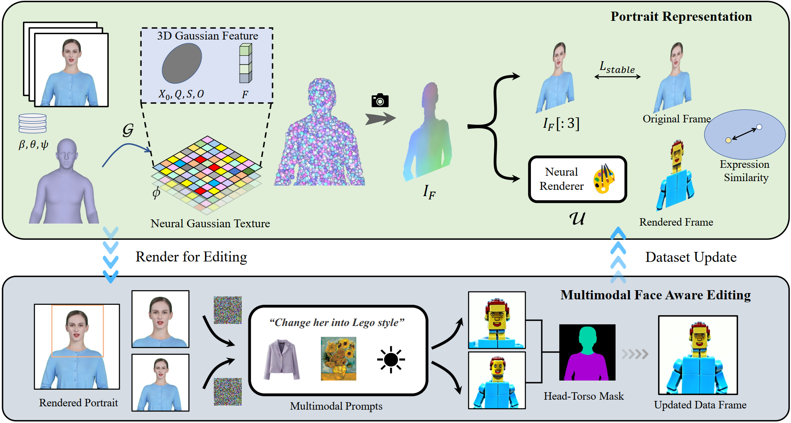

# Portrait Video Editing Empowered by Multimodal Generative Priors

Official implementation of the SIGGRAPH Asia 2024 paper "Portrait Video Editing Empowered by Multimodal Generative Priors". This repository contains code, data and released pretrained model.

**|[Project Page](https://ustc3dv.github.io/PortraitGen/)|[Paper](https://arxiv.org/pdf/2409.13591)|[Dataset](https://drive.google.com/file/d/1BmxY-xjDwTi9glg0ukTxmHv4Xn7p_Se8/view?usp=sharing)|[Pretrained Models](https://drive.google.com/file/d/18-_vtPOFmX8dmuDbMX17kowPODXGGo6P/view?usp=sharing)|**
<!-- **|[Project Page](XXX)|[Paper](XXX)|** -->


PortraitGen is a powerful portrait video editing method that achieves consistent and expressive stylization with multimodal prompts. Given a monocular RGB video, our model could perform high-quality text driven editing, image driven editing and relighting.

## Pipeline

We first track the SMPL-X coefficients of the given monocular video, and then use a Neural Gaussian Texture mechanism to get a 3D Gaussian feature field. These neural Gaussians are further splatted to render portrait images. An iterative dataset update strategy is applied for portrait editing, and a Multimodal Face Aware Editing module is proposed to enhance expression quality and preserve personalized facial structures.




## Setup

create environment
```
conda create -n portraitgen python=3.9
conda activate portraitgen
pip install -r requirements.txt
```

Install torch and torchvision [according to your OS and Compute Platform](https://pytorch.org/get-started/previous-versions/).

Install [nvdiffrast](https://github.com/NVlabs/nvdiffrast)
```
git clone https://github.com/NVlabs/nvdiffrast.git
cd nvdiffrast
pip install .
```

Install [EMOCA](https://emoca.is.tue.mpg.de/) according to its README.

Install [simple-knn](https://github.com/camenduru/simple-knn/tree/44f764299fa305faf6ec5ebd99939e0508331503).

Install neural feature splatting module:
```
cd diff_gaussian_rasterization_fea
pip install -e .
```

Download [SMPL-X 2020](https://smpl-x.is.tue.mpg.de/download.php) models in code/dmm_models/smplx/SMPLX2020, the required files are:
```
MANO_SMPLX_vertex_ids.pkl
pts51_bary_coords.txt
pts51_faces_idx.txt
SMPLX_FEMALE.npz
SMPL-X__FLAME_vertex_ids.npy
SMPLX_MALE.npz
SMPLX_NEUTRAL_bc.npz
SMPLX_NEUTRAL.npz
SMPLX_NEUTRAL.pkl
SMPLX_to_J14.pkl
wflw_to_pts51.txt
```

## Reconstruction
Download our [preprocessed dataset](https://drive.google.com/file/d/1BmxY-xjDwTi9glg0ukTxmHv4Xn7p_Se8/view?usp=sharing) and unzip it to `./testdataset` or organize your own data in the same folder structure.


Then you could run `run_recon.sh` to reconstruct a 3D Gaussian portrait.

```
bash run_recon.sh GPUID "IDNAME" 
```
You could also use our [pretrained portrait models](https://drive.google.com/file/d/18-_vtPOFmX8dmuDbMX17kowPODXGGo6P/view?usp=sharing) to run editing directly. After downloading dataset and models, run:
```
python move_ckpt.py
rm -rf ./pretrained
```
## Text Driven Editing

We use [InstructPix2Pix](https://www.timothybrooks.com/instruct-pix2pix/) as 2D editor. 

Then you could run `run_edit_ip2p.sh` to edit with instruction style prompt.
```
bash run_edit_ip2p.sh GPUID "IDNAME" "prompt"
```

## Image Driven Editing

### Style Transfer

We use [Neural Style Transfer](https://github.com/tjwhitaker/a-neural-algorithm-of-artistic-style) for style transfer. Firstly git clone the repository to ./code
```
git clone https://github.com/tjwhitaker/a-neural-algorithm-of-artistic-style.git ./code/neuralstyle
```

Then run:
```
bash run_edit_style.sh GPUID "IDNAME" /your/reference/image/path
```

We have prepared some reference style images in ./ref_image

### Virtual Try-on

We use [AnyDoor](https://github.com/ali-vilab/AnyDoor) to change the clothes of the subject. 

Firstly git clone AnyDoor:
```
git clone https://github.com/ali-vilab/AnyDoor.git ./code/anydoor
```
Then follow its requirments.txt to install necessary packages and download its released models.

Finally run:
```
bash run_edit_anydoor.sh GPUID "IDNAME" /your/reference/image/path
```

We have prepared some reference cloth images in ./ref_image

## Relighting
Firstly git clone [IC-Light](https://github.com/lllyasviel/IC-Light):
```
git clone https://github.com/lllyasviel/IC-Light ./code/ReLight
```

Then run:
```
bash run_edit_relight.sh GPUID "IDNAME" BG prompt
```
`BG` is the direction of light. `prompt` is the description of light.

You could also use `relight.py` to generate background images according to the prompts.

## Citation

If you find our paper useful for your work please cite: 

```
@inproceedings{Gao2024PortraitGen,
title = {Portrait Video Editing Empowered by Multimodal Generative Priors},
author = {Xuan Gao and Haiyao Xiao and Chenglai Zhong and Shimin Hu and Yudong Guo and Juyong Zhang},
booktitle = {ACM SIGGRAPH Asia Conference Proceedings},
year = {2024},
}

```

## Acknowledgement

